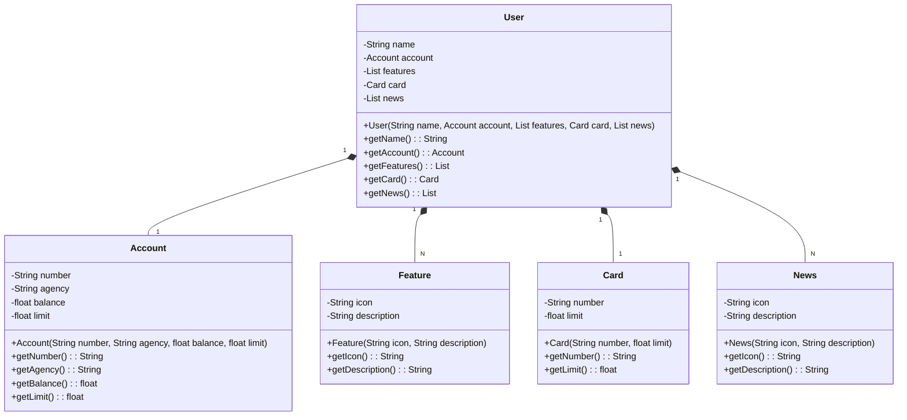

# Santander Bootcamp 2024 DIO
Desenvolvimento de uma RESTful API criada durante o Santander Bootcamp 2024 na DIO

## Diagrama de Classes

```mermaid
classDiagram
    class User {
        -String name
        -Account account
        -List<Feature> features
        -Card card
        -List<News> news
        +User(String name, Account account, List<Feature> features, Card card, List<News> news)
        +getName(): String
        +getAccount(): Account
        +getFeatures(): List<Feature>
        +getCard(): Card
        +getNews(): List<News>
    }
    
    class Account {
        -String number
        -String agency
        -float balance
        -float limit
        +Account(String number, String agency, float balance, float limit)
        +getNumber(): String
        +getAgency(): String
        +getBalance(): float
        +getLimit(): float
    }
    
    class Feature {
        -String icon
        -String description
        +Feature(String icon, String description)
        +getIcon(): String
        +getDescription(): String
    }
    
    class Card {
        -String number
        -float limit
        +Card(String number, float limit)
        +getNumber(): String
        +getLimit(): float
    }
    
    class News {
        -String icon
        -String description
        +News(String icon, String description)
        +getIcon(): String
        +getDescription(): String
    }
    
    User "1" *-- "1" Account
    User "1" *-- "N" Feature
    User "1" *-- "1" Card
    User "1" *-- "N" News
```
